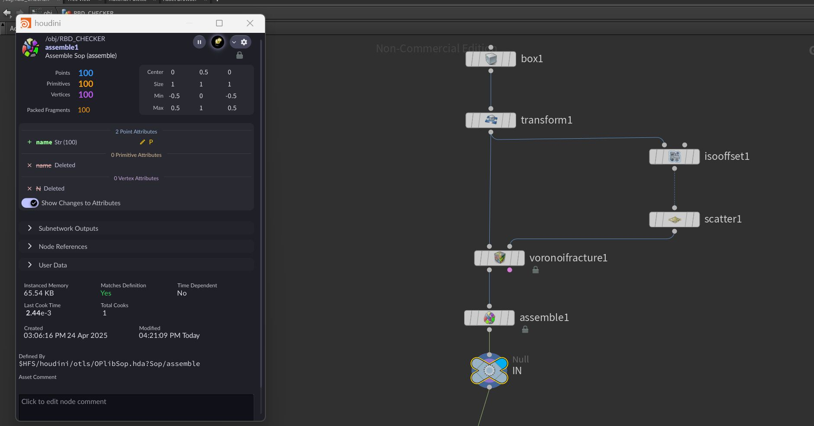
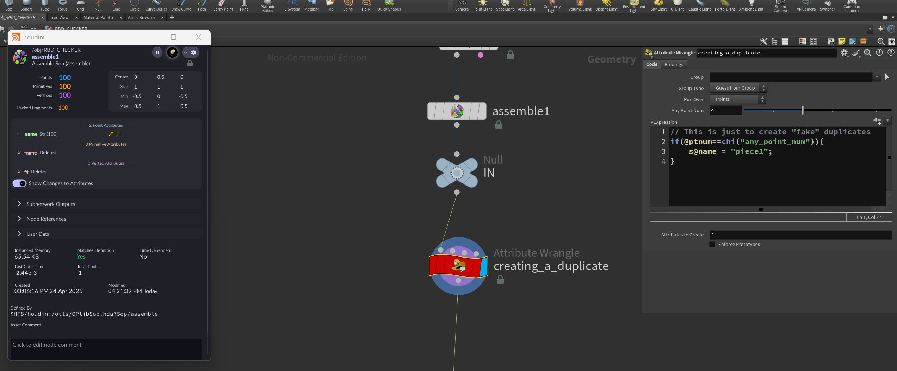
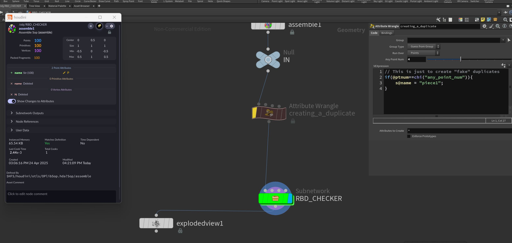
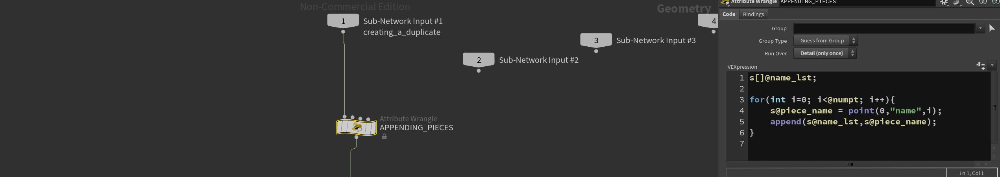
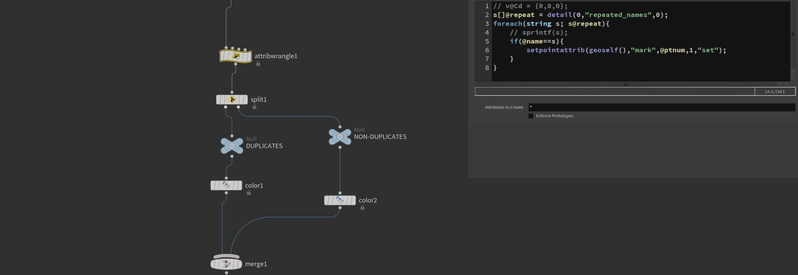
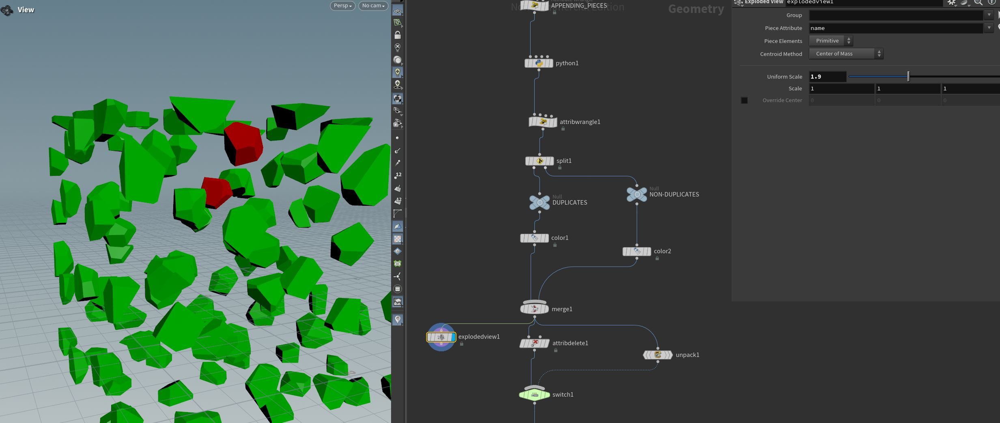

# Houdini HDA and Python Scripts

Welcome to the Houdini HDA and Python Scripts repository! This project contains various Houdini Digital Assets (HDA) and Python scripts to streamline workflows, automate tasks, and enhance functionality within Houdini.

## Features
- Custom Houdini Digital Assets (HDA) for procedural workflows.
- Python scripts to extend Houdini functionality.
- Automation tools for simplifying repetitive tasks.
- Well-documented code for ease of use and integration.

<break>

### Projects:
1. [Backup Tool](#backupTool)
2. [Json Exporter](#jsonExporter)
3. [RBD Attributes Checker](#rbd-checker)
4. [Asset Filter](#asset-filter)


### Documentation
<a id="backupTool">1. In this hda you can create a backup tool of any node by using the operator list to select the nodes you want to backup and this will be converted into a .py file with all the modifications saved. Doc to follow

<a id="jsonExporter">2. In this program a HDA has been created to select the nodes(Geomtry context) to export them in JSON format which can be read in cross platform applications for quick export/import. Further research into converting JSON to USD is underway.</a>
   - Doc to follow.

#### 3. RBD Checker

+ The python script can be found here: [Code](https://github.com/VarishtRaheja/Houdini-Pipeline-Dev/blob/main/Scripts/RBD_Check.py)

<a id="rbd-checker">In this script I have combined both VEX and Python to check for duplicated names<i>(name attribute)</i>. I have also added a feature to change the color of the node to see if duplicate names exist. Red for duplicates and green is good to go.
   <p> Lets start with creating a simple voronoi fracture with a basic 3d geometry shape(box)
   
   

   Then create a wrangle node to manually "fake" a duplication by doing the following.

   

   I have bypassed the wrangle node here to show you that we can create an event to change the color of the node depending on cerain actions. So if the duplicate does not exist then the node turns green else red in color.

   

   Then I have created a wrangle to initialise an empty list and add all the points with their corresponding name attribute.

   

   This is the main part of the python code where the color of the node is being set and the names are being registered to a list which are not duplicates. The duplicated name is then conditioned check and passed downstream as an attribute to keep proceduralism alive. This is then being split based on the attribute and we can visulise it by adding a different color attribute to each stream before merging it back together.

   

   

---

#### 4. Asset Filter
<a id=asset-filter> In this script/HDA, path sequence and files are being managed based on type and whether certain files/directories based on extension want to be included or excluded.</a>

+ Main python code: [Code](https://github.com/VarishtRaheja/Houdini-Pipeline-Dev/blob/main/Scripts/Asset_Filter.py)

<break>
   
Buttons have been added for further functionality.

```py
# This button will remove all "file" type geos which are being imported from the files speicifed by the user.
   def buttonPress():
       obj_node = hou.node("/obj/Asset_Filter/asset_filter")
       for child in obj_node.children():
           if child.type().name()=="file":
               child.destroy()
               c = hou.Color()
               c.setRGB((1,0,0))
       hou.ui.displayMessage("File nodes deleted.")

```

   Wrangle code to split file path and name:

```C
// Split the full path name into name and dir path.
string dir, name;
splitpath(s@path,dir,name);

// Accessing file attributes from HDA
string exclude_file = chs("../exclude_file");
string include_file = chs("../include_file");

// Accessing folder attributes from HDA
string exclude_dir = chs("../exclude_dir");
string include_dir = chs("../include_dir");

// unpack folder/file
string pack_dir = chs("../pack_dir");

// Adding to delete grps the files that cant be found.
if(exclude_file != "" && re_find(exclude_file,name)!=""){
    setpointgroup(geoself(),"delete",i@ptnum,1,"set");
}
if(include_file != "" && re_find(include_file,name) == ""){
    setpointgroup(geoself(),"delete",i@ptnum,1,"set");
}
if(exclude_dir != "" && re_find(exclude_dir,dir) != ""){
    setpointgroup(geoself(),"delete",i@ptnum,1,"set");
}
if(include_dir != "" && re_find(include_dir,dir) == ""){
    setpointgroup(geoself(),"delete",i@ptnum,1,"set");
}

if(pack_dir != "" && re_find(pack_dir,name) != ""){
    setpointgroup(geoself(),"unpack_grp",i@ptnum,1,"set");
}

``` 
Then to split sequence and non-sequence

```C
   // Split the full path name into name and dir path.
   string dir, name;
   splitpath(s@path,dir,name);

   // Get the files with bgeo extension
   string pattern = re_find("[\\.][0-9]+[\\.]bgeo",name);

   // Replace the extension with empty string to get frame number only.
   string frame = re_replace("[\\.]bgeo","",pattern)[1:];

   // Creating the padding
   string pad = sprintf("\\$\\F%d",len(frame));

   // converting string to float for sequences
   int f = frame != "" ? atoi(frame) : -1000;

   if(f != -1000){
       setpointgroup(geoself(),"sequence",i@ptnum,1,"set");
       s@__name = re_replace(frame,"",name);
       i@__frame = f;
       s@path = re_replace(frame,pad,name);
   } else{
       s@path = re_replace(frame,"",name);
   }
   string full_path = concat(dir,"/",s@path);

```

---

## Steps to download and install HDA

Installing the HDA in Houdini
1. Method: Manual Installation
- Open Houdini.
- Go to Assets -> Install Asset Library.
- Locate the .hda file on your computer and select it.
- Click Install.

<break>

2. Method: Installing in Houdini Preferences
- Place the .hda file in your Houdini preferences folder:
Documents/HoudiniXX.X/otls/
- (Replace XX.X with your Houdini version, e.g., 20.5.)
- Restart Houdini, and it should automatically load the asset.

